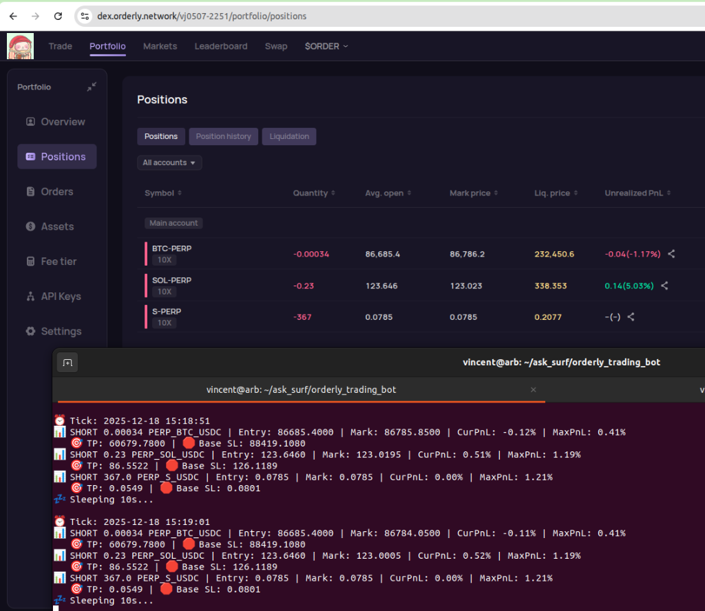
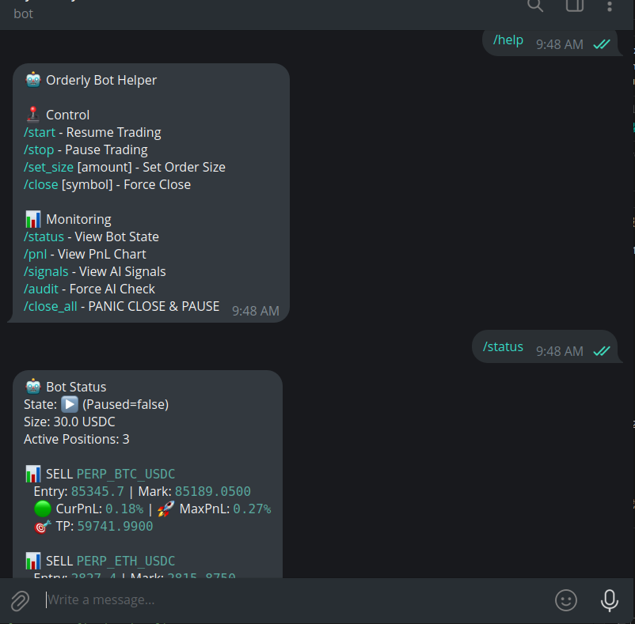

# 🤖 SurfAI api ＋ Orderly Network DEX Trading Bot 

這是一個基於 Python 的自動化交易機器人，**SurfAI api** + Orderly Network (<https://dex.orderly.network/dex>) 設計。
它結合了 **SurfAI api** 的市場分析能力與 **Stateful Stepped Trailing Stop (狀態記憶階梯式移動止損)** 風控機制，能夠全天候自動執行交易並管理風險。

## ✨ 核心功能 (Core Features)

### 1. 🧠 AI 驅動分析 (AI-Powered Analysis)

- 使用 **SurfAI API** quick ask。
- 綜合分析 K 線型態 (OHLCV)、技術指標 (MA30/45/60, RSI, Bollinger Bands) 與市場情緒。
- 輸出明確的 JSON 交易訊號 (BUY/SELL/HOLD)，包含信心分數與進出場理由。

### 2. 🛡️ 狀態記憶風控 (Stateful Risk Management)

- **High Water Mark (HWM) 機制**:
  - 系統會透過 PostgreSQL 資料庫記住每筆交易的「最高浮盈價格」(Long) 或「最低浮盈價格」(Short)。
  - **拒絕利潤回吐**: 即使機器人重啟，風控狀態也能無縫接軌，不會因為重啟而丟失已鎖定的利潤保護。
- **階梯式移動止損 (Stepped Trailing Stop)**:
  - **Tier 1 (Fees Covered)**: 獲利達 1.5% 時，止損上移至保本損益點 (覆蓋手續費)。
  - **Tier 2 (Lock Profit)**: 獲利達 3.0% 時，鎖定至少 1.5% 利潤。

### 3. 🌐 全自動多幣種掃描

- 自動監控市場交易量前 5 名 (Top 5) 的熱門幣種 (如 BTC, ETH, SOL, DOGE 等)。
- 動態權重分配與獨立的冷卻時間 (Cooldown) 管理。

### 4. 📊 即時監控儀表板 (Dashboard)

- 內建 Streamlit 儀表板 (`dashboard.py`)。
- 視覺化呈現：
  - **即時權益 (Net Equity)**: 清楚列出 現金餘額 vs 權益 (含未實現損益)。
  - **預估損益 (Estimated PnL)**: 針對手動平倉 (Zombie Trade)，Bot 會自動抓取當下市價估算 PnL，而非紀錄 0。
  - AI 歷史訊號紀錄。
  - 帳戶餘額與交易歷史。
  - **單元測試 (Unit Tests)**: 內建 `tests/test_dual_track.py` 確保核心風控邏輯正確無誤。

### 5. 實戰運行截圖 (Live Execution)


*圖：機器人於終端機監控多個幣種 (BTC/SOL/S) 的持倉狀態，即時計算 PnL 與動態止損位。*

### 6. 📱 Telegram 遙控與監控 (New)

支援透過 Telegram 進行遠端管理，無需登入伺服器即可掌握機器人狀態。


*圖：Telegram Bot 互動介面，支援指令控制與即時狀態查詢。*

- **控制指令**:
  - `/start` / `/stop`: 一鍵暫停或恢復機器人交易 (Panic Button)。
  - `/set_size [amount]`: 動態調整下單金額 (USDC)。
  - `/close [symbol]`: 強制平倉指定幣種。
  - `/close_all`: **緊急全平倉** 並暫停機器人。
- **監控指令**:
  - `/status`: 查看目前持倉、浮動盈虧 (PnL) 與 HWM 狀態。
  - `/pnl`: 繪製歷史損益曲線圖。
  - `/signals`: 查看最近的 AI 分析訊號與信心分數。
  - `/audit`: 強制觸發 AI 審計 (Stale Check)。

---

## 🛡️ 雙軌制風控策略 (Dual-Track Risk Management) **[NEW]**

本系統採用業界領先的混合式風控架構，結合機械紀律與 AI 認知能力：

### 1. ⚡ 機械層 (Mechanical Layer) - 無限追蹤 (Dynamic Ratchet)

負責處理秒級的價格波動，保護獲利不回吐。

- **Tier 1 (求生)**: 獲利 > 1.5% 時，止損上移至保本點 (+0.2%)。
- **Tier 2 (起飛)**: 獲利 > 3.0% 時，啟動 **動態棘輪 (Dynamic Ratchet)**。
  - 止損線將永遠緊跟最高價 (HWM) **1.5%** 的距離。
  - **無獲利上限**：即使行情噴出 100%，止損也會跟到 98.5%，確保吃到完整魚身。

### 2. 🧠 認知層 (Cognitive Layer) - 逾期重審 (Stale Position Check)

負責處理長時間滯留的無效倉位。

- **觸發條件**: 持倉超過 **12 小時** 且未進入 Tier 2 高獲利區。
- **AI 審判**: 系統會強制喚醒 AI，重新審視最新的 K 線結構。
- **處置**: 若 AI 判定趨勢已失效，將直接市價平倉 (Time Stop)，釋放資金。

---

## 🏗️ 系統架構 (System Architecture)

專案採用模組化設計，易於維護與擴充：

| 模組 (Module) | 功能描述 (Description) |
|:---|:---|
| **`main.py`** | **總指揮 (Orchestrator)**。負責啟動與協調各模組，執行 Top 5 掃描循環，並處理優雅關閉 (Graceful Shutdown)。 |
| **`ai_analyst.py`** | **大腦 (Brain)**。負責與 SurfAI API 溝通，將複雜的市場數據轉化為結構化的交易決策。 |
| **`execution.py`** | **執行與風控 (Execution & Risk)**。負責下單 (Order Placement) 與持倉監控 (`monitor_risks`)。包含核心的 HWM 止損邏輯與 Orderbook 解析。 |
| **`market_data.py`** | **感知器 (Sensors)**。負責串接 Orderly SDK，抓取 K 線、Orderbook 深度與帳戶資訊。內建 API 備援機制 (Fallback)。 |
| **`database.py`** | **記憶體 (Memory)**。基於 PostgreSQL，負責持久化儲存交易日誌、HWM 狀態與 PnL 結算紀錄。 |
| **`config.py`** | **設定檔 (Configuration)**。集中管理參數 (MA 週期, 止損 % 數, 槓桿倍數等)。 |

---

## 🚀 快速開始 (Quick Start)

### 1. 環境準備

確保已安裝 Python 3.10+。

### 1-A. 資料庫準備 (PostgreSQL with Docker)

本專案推薦使用 Docker 部署 PostgreSQL，確保環境隔離與資料持久化。

```bash
# 1. 安裝 Docker (Ubuntu)
sudo apt update
sudo apt install -y docker.io docker-compose
sudo systemctl enable docker --now

# 2. 啟動 PostgreSQL Container
# - p 5432:5432: 開放 Port
# - v $PWD/pgdata:/var/lib/postgresql/data: 掛載當前目錄的 pgdata 資料夾確保資料不遺失
# --restart always: 開機自動啟動
mkdir -p pgdata
sudo docker run -d \
  --name orderly_db \
  --restart always \
  -e POSTGRES_USER=myuser \
  -e POSTGRES_PASSWORD=mypassword \
  -e POSTGRES_DB=mydb \
  -p 5432:5432 \
  -v $(pwd)/pgdata:/var/lib/postgresql/data \
  postgres:15
```

### 1-B. Python 環境準備

```bash
# 建立並啟用 Conda 環境 (推薦)
conda create -n orderly_bot python=3.10
conda activate orderly_bot

# 安裝依賴
pip install -r requirements.txt
```

### 1-C. 檢查既有 Docker 環境 (Optional)

若您發現 Port 5432 已被佔用，或想確認既有的 PostgreSQL Container 是否符合需求，可使用以下指令檢查：

```bash
# 1. 查看正在執行的 Container 與 ID
docker ps

# 2. 檢查該 Container 的環境變數 (確認 User/Pass/DB 是否匹配)
docker inspect --format='{{range .Config.Env}}{{println .}}{{end}}' <CONTAINER_ID_OR_NAME>

# 3. 檢查資料掛載路徑 (確認資料存在哪裡)
docker inspect --format='{{range .Mounts}}Source: {{.Source}} -> Destination: {{.Destination}}{{println}}{{end}}' <CONTAINER_ID_OR_NAME>
```

### 2. 設定環境變數 (.env)

複製 `.env.example` (若有) 或建立 `.env` 檔案，填入以下資訊：

```ini
# Orderly Network Credentials
可以用測試錢包連接 
https://dex.orderly.network/vj0507-2251/portfolio/api-key
申請 API 後填入下列資料

ORDERLY_ACCOUNT_ID="<YOUR_ACCOUNT_ID>"
ORDERLY_KEY="<YOUR_API_KEY>"
ORDERLY_SECRET="<YOUR_API_SECRET>"

# AI Service (AskSurf / Gemini Wrapper)
ASKSURF_API_KEY="<YOUR_ASKSURF_KEY>"

# Database Config
DB_NAME="<DB_NAME>"
DB_USER="<DB_USER>"
DB_PASSWORD="<DB_PASSWORD>"
DB_HOST="localhost"
DB_PORT="5432"

# Telegram Config (Optional)
TELEGRAM_BOT_TOKEN="<YOUR_BOT_TOKEN>" # Get from @BotFather
TELEGRAM_CHAT_ID="<YOUR_CHAT_ID>"     # Get from @userinfobot
```

#### 如何取得 Telegram 設定？
1.  **BOT_TOKEN**:
    - 在 Telegram 搜尋 **@BotFather**。
    - 輸入 `/newbot` 並依指示建立機器人。
    - 複製它給您的 `HTTP API Token`。
2.  **CHAT_ID**:
    - 在 Telegram 搜尋 **@userinfobot**。
    - 點擊 Start，它會回傳您的 `Id` (一串數字，如 `123456789`)。


### 3. 啟動機器人

使用 `run.sh` 腳本啟動，它會自動處理環境變數與錯誤重啟。

```bash
chmod +x run.sh
./run.sh
```
或是手動執行
```bash
python3 main.py
```

### 4. 啟動 TG Bot 可以遠端從 TG 控制

另開一個終端機視窗：

```bash
python3 tg_bot.py
```

### 5. 啟動監控儀表板（如果需要）

另開一個終端機視窗：

```bash
streamlit run dashboard.py
```

---

## ⚠️ 重要機制說明

### Orderbook 解析與備援

系統優先使用 Orderbook (買一/賣一價) 進行精確估值。若因網路波動導致 Orderbook 獲取失敗 (Timeout)，系統會自動 **Fallback** 切換至 OHLCV K 線數據，確保風控監控**永不中斷**。

### 資料庫狀態保護 (Stale Data Protection)

為防止資料庫中的舊紀錄 (Stale Data) 與 API 數據不一致，`execution.py` 內建 **Legacy Mode HWM Protection**。若偵測到 DB Entry 與 API Entry 誤差超過 1%，系統會發出黃色警告並保留既有的 HWM 紀錄 (而非強制歸零)，確保在數據誤差下仍能維持 MaxPnL 的記憶與計算準確性。


---

## 🤝 貢獻 (Contributing)

歡迎 Pull Requests 來改進策略或修復 Bug。

## 📜 授權 (License)

MIT License
